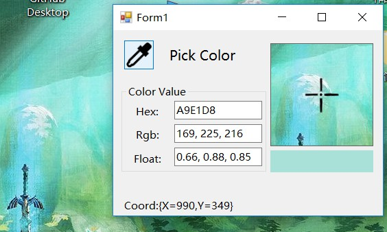

####Description
&emsp;&emsp;When I write shader on the shadertoy or other editer, It's very commen to get color from screen where picture was opened. So I write this simple program for picking color.

####How to use
&emsp;&emsp;Button down in the pick button, then you can move mouse to where you can get your wanted color, finally button up!
&emsp;&emsp;The example is following. Enjoy it!hhhh~

;